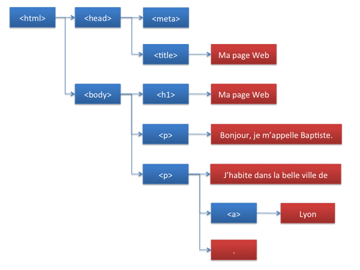
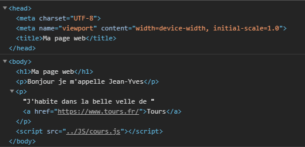
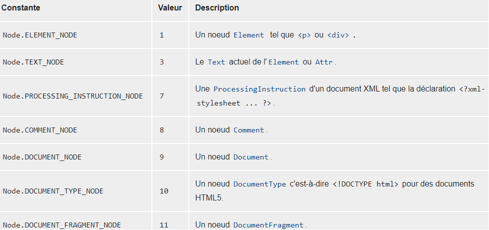
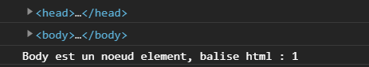
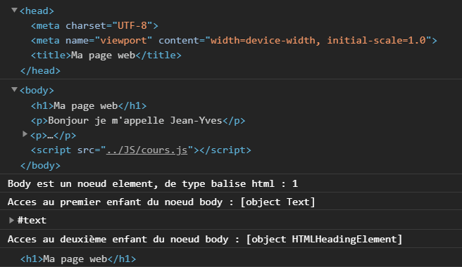
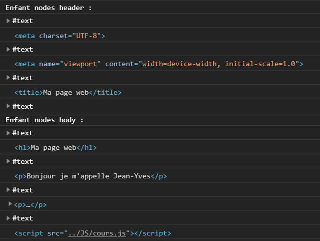
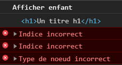

# JAVASCRIPT_WEB_REACTIVE

# Le DOM (Document Object Model)

## Le DOM
Le DOM definit la structure d'une page et le moyen d'interagir avec elle : il s'agit d'une interface de programmation, ou API (Application Programming Interface).

* Creation de la **page html** du chapitre_1. Une page html a la structure suivante:



* Chaque entite de l'arborescence est appelee un noeud (node). On distingue deux types de noeud :
    * Ceux (en bleu) qui correspondent à des elements HTML, comme `<body>` ou `<p>`. Ces noeud peuvent avoir des sous-noeud, appeles fils ou enfants(children).
    * Ceux (en rouge) qui correspondent au contenu textuel de la page. Ces noeud ne peuvent pas avoir de fils.


* Acceder au DOM a l'aide de la variable js `document`, correspondant a l'element `<html>`. 
    * Cette variable est de type Object
    * Et possede les  proprietes `<head>` et `<body>`
    * Creation du **script javascript** et integration de celui-ci a notre html a l'aide de la balise `<script>`, place a la fin de notre page html avant fermeture de la derniere balise `</body>`.
    Lors de l'execution de la page html dans notre navigateur avec la console de debug ouverte nous pouvons constater :



* Decouvrer le type de noeud: Chaque type de noeud a une propriete `nodeType` qui indique son type. La valeur de cette propriete est `document.ELEMENT_NODE` pour un noeud "element" (balise HTML) et `document.TEXT_NODE` pour un noeud textuel. Testons cela, dans notre fichier .js. Ci-dessous les descriptions des possibles retour:





* Acceder aux enfants d'un noeud d'un element.
<span style="color:red">Comme nous l'avons vu precedemment, seuls les noeuds de type element peuvent avoir des sous-noeuds (appeles enfants).</span>

Exemple d'acces au premier enfant du noeud body

```js
console.log(document.body.childNodes[0])
```


* Parcourir la liste des noeuds enfants. A l'aide de boucle :

```js
for (let index = 0; index < document.body.childNodes.length; index++) {
    console.log(document.body.childNodes[index]);
}
```



* Acceder au parent d'un noeud d'un element.

Exemple d'acces au parent du noeud 1 du body

```js
let noeud1 = document.body.childNodes[1]
console.log(noeud1.parentNode)

```


* Autres proprietes (`firstChild`, `lastChild`, `nextSibling`)

[node_MDN](https://developer.mozilla.org/fr/docs/Web/API/Node)

## TP 1

```js
function afficherEnfant(noeud, indice) {
    if (noeud.nodeType === document.ELEMENT_NODE) {
        if (indice >= 0 && indice < noeud.childNodes.length) {
            console.log("Afficher enfant");
            console.log(noeud.childNodes[indice]);
        } else {
            console.error("Indice incorrect");
        }
    } else {
        console.error("Type de noeud incorrect");
    }
}
afficherEnfant(document.body, 1);
afficherEnfant(document.body, -1);
afficherEnfant(document.body, 8);
afficherEnfant(document.body.childNodes[0], 0);
```


## Parcourir le DOM
