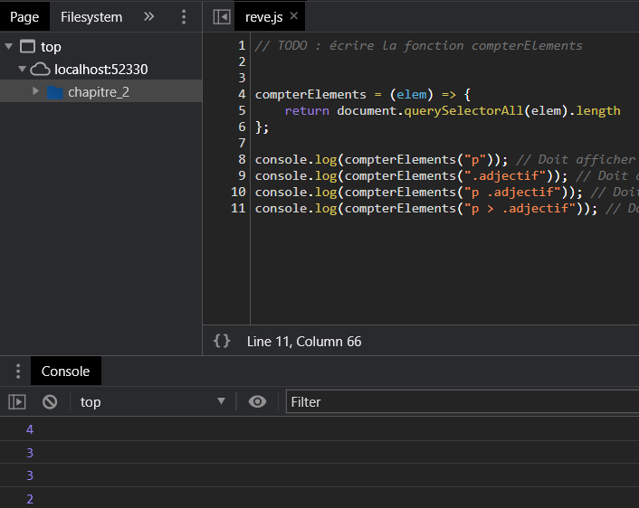
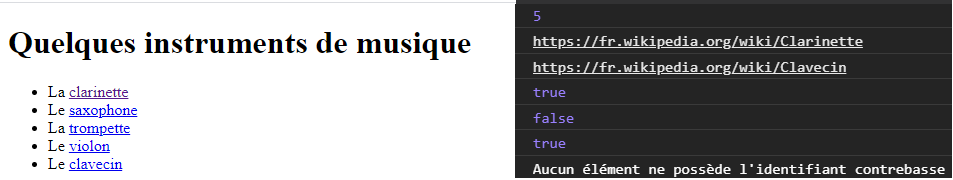

# JAVASCRIPT_WEB_REACTIVE
<!-- TOC -->

- [JAVASCRIPT_WEB_REACTIVE](#javascript_web_reactive)
- [Le DOM (Document Object Model)](#le-dom-document-object-model)
    - [Le DOM (chapitre_1)](#le-dom-chapitre_1)
    - [TP](#tp)
    - [Parcourir le DOM (chapitre_2)](#parcourir-le-dom-chapitre_2)
    - [Modifier la structure de la page (chapitre_3)](#modifier-la-structure-de-la-page-chapitre_3)
    - [Donner du style a vos elements (chapitre_4)](#donner-du-style-a-vos-elements-chapitre_4)
- [Interaction avec les utilisateurs (chapitre_5)](#interaction-avec-les-utilisateurs-chapitre_5)
    - [Reagir aux evenements](#reagir-aux-evenements)

<!-- /TOC -->
# Le DOM (Document Object Model)

## Le DOM (chapitre_1)


[cours.html](./chapitre_1/HTML/cours.html)
[cours.JS](./chapitre_1/JS/cours.js)

[Exercice enfant.html](./chapitre_1/HTML/enfant.html)
[Exercice enfant.JS](./chapitre_1/JS/enfant.js)


Le DOM definit la structure d'une page et le moyen d'interagir avec elle : il s'agit d'une interface de programmation, ou API (Application Programming Interface).

* Creation de la **page html** du chapitre_1. Une page html a la structure suivante:


* Chaque entite de l'arborescence est appelee un noeud (node). On distingue deux types de noeud :
    * Ceux (en bleu) qui correspondent a des elements HTML, comme `<body>` ou `<p>`. Ces noeud peuvent avoir des sous-noeud, appeles fils ou enfants(children).
    * Ceux (en rouge) qui correspondent au contenu textuel de la page. Ces noeud ne peuvent pas avoir de fils.


* Acceder au DOM a l'aide de la variable js `document`, correspondant a l'element `<html>`. 
    * Cette variable est de type Object
    * Et possede les  proprietes `<head>` et `<body>`
    * Creation du **script javascript** et integration de celui-ci a notre html a l'aide de la balise `<script>`, place a la fin de notre page html avant fermeture de la derniere balise `</body>`.
    Lors de l'execution de la page html dans notre navigateur avec la console de debug ouverte nous pouvons constater :


* Decouvrer le type de noeud: Chaque type de noeud a une propriete `nodeType` qui indique son type. La valeur de cette propriete est `document.ELEMENT_NODE` pour un noeud "element" (balise HTML) et `document.TEXT_NODE` pour un noeud textuel. Testons cela, dans notre fichier .js. Ci-dessous les descriptions des possibles retour:


* Acceder aux enfants d'un noeud d'un element.
<span style="color:red">Comme nous l'avons vu precedemment, seuls les noeuds de type element peuvent avoir des sous-noeuds (appeles enfants).</span>

Exemple d'acces au premier enfant du noeud body

```js
console.log(document.body.childNodes[0])
```


* Parcourir la liste des noeuds enfants. A l'aide de boucle :

```js
for (let index = 0; index < document.body.childNodes.length; index++) {
    console.log(document.body.childNodes[index]);
}
```


* Acceder au parent d'un noeud d'un element.

Exemple d'acces au parent du noeud 1 du body

```js
let noeud1 = document.body.childNodes[1]
console.log(noeud1.parentNode)

```


* Autres proprietes (`firstChild`, `lastChild`, `nextSibling`)

[node_MDN](https://developer.mozilla.org/fr/docs/Web/API/Node)

## TP

```js
function afficherEnfant(noeud, indice) {
    if (noeud.nodeType === document.ELEMENT_NODE) {
        if (indice >= 0 && indice < noeud.childNodes.length) {
            console.log("Afficher enfant");
            console.log(noeud.childNodes[indice]);
        } else {
            console.error("Indice incorrect");
        }
    } else {
        console.error("Type de noeud incorrect");
    }
}
afficherEnfant(document.body, 1);
afficherEnfant(document.body, -1);
afficherEnfant(document.body, 8);
afficherEnfant(document.body.childNodes[0], 0);
```


## Parcourir le DOM (chapitre_2)

* Plutot que de parcourir le DOM noeud par noeud, on peut acceder rapidement a un ou plusieurs elements en utilisant des methodes de selection.
* Les methodes `getElementsByTagName`, `getElementsByClassName` et `getElementById` permettent respectivement de rechercher des elements par nom de balise, par classe et par identifiant. Les deux premieres methodes renvoient une liste, la derniere renvoie un seul element.
* Les methodes `querySelectorAll` et `querySelector` permettent de rechercher des elements en utilisant un selecteur CSS. La premiere methode renvoie tous les elements correspondants, la seconde renvoie uniquement le premier.
* La propriete `innerHTML` renvoie le contenu HTML d'un element. La propriete `textContent` renvoie son contenu textuel, sans le balisage HTML.
* Les methodes `getAttribute` et `hasAttribute` permettent d'acceder aux attributs d'un element.
* La propriete `classList` et sa methode `contains` permettent d'acceder aux classes d'un element.




[cours.html](./chapitre_2/HTML/cours.html)
[cours.JS](./chapitre_2/JS/cours.js)

[Exercice enfant.html](./chapitre_2/HTML/instruments.html)
[Exercice enfant.JS](./chapitre_2/JS/instruments.js)


[Exercice reve.html](./chapitre_2/HTML/reve.html)
[Exercice reve.JS](./chapitre_2/JS/reve.js)

## Modifier la structure de la page (chapitre_3)

* Les proprietes `innerHTML`, `textContent` et `classList` ainsi que la methode `setAttribute` permettent de modifier les informations d'un element du DOM.
* La creation d'un nouveau noeud s'effectue avec les methodes `createTextNode` pour un noeud textuel et `createElement` pour un element.
* La methode `appendChild` permet d'inserer un nouveau noeud comme dernier enfant d'un element du DOM.
* Les methodes `insertBefore` et `insertAdjacentHTML` offrent des possibilites alternatives pour ajouter du contenu.
* On peut remplacer un noeud existant avec la methode `replaceChild` ou le supprimer avec `removeChild`.
* La manipulation du DOM en JavaScript doit se faire de maniere raisonnee afin de ne pas degrader les performances.

[cours.html](./chapitre_3/HTML/cours.html)
[cours.JS](./chapitre_3/JS/cours.js)

[Exercice journaux.html](./chapitre_3/HTML/journaux.html)
[Exercice journaux.JS](./chapitre_3/JS/journaux.js)

[Exercice dictionnaire.html](./chapitre_3/HTML/dictionnaire.html)
[Exercice dictionnaire.JS](./chapitre_3/JS/dictionnaire.js)


## Donner du style a vos elements (chapitre_4)

[Correspondance de style CSS Javascript](https://developer.mozilla.org/en-US/docs/Web/CSS/CSS_Properties_Reference)


* La propriete JavaScript `style` represente l'attribut `style` d'un element du DOM. Elle permet de modifier le style de cet element en definissant la valeur de ses proprietes CSS.
* Les proprietes CSS composees s'ecrivent avec la norme `camelCase` en JavaScript. Par exemple, `font-family` devient `fontFamily`.
* La propriete JavaScript `style` est insuffisante pour acceder au style d'un element. Pour cela, on utilise la fonction `getComputedStyle`.

[cours.html](./chapitre_4/HTML/cours.html)
[cours.JS](./chapitre_4/JS/cours.js)
[cours.CSS](./chapitre_4/CSS/cours.css)

[Exercice couleurs.html](./chapitre_4/HTML/couleurs.html)
[Exercice couleurs.JS](./chapitre_4/JS/couleurs.js)

[Exercice infos.html](./chapitre_4/HTML/infos.html)
[Exercice infos.JS](./chapitre_4/JS/infos.js)
[Exercice infos.css](./chapitre_4/CSS/infos.css)


# Interaction avec les utilisateurs (chapitre_5)

## Reagir aux evenements

* On peut rendre une page web interactive en ecrivant du code JavaScript qui reagit aux evenements declenches sur la page.
* De nombreux types d'evenements peuvent etre geres. Chaque type d'evenement est associe a un objet `Event` specifique qui apporte des informations sur l'evenement via ses proprietes.
* Les evenements `keypress`, `keydown` et `keyup` permettent de reagir a l'utilisation du clavier.
* Les evenements `click`, `mousedown` et `mouseup` permettent de gerer les interactions avec la souris.
* Le chargement et la fermeture de la page web sont associes aux evenements `load` et `beforeunload`.
* Un evenement se propage dans l'arborescence du DOM depuis son noeud d'origine jusqu'a la racine du document. Cette propagation peut etre interrompue a l'aide de la methode `stopPropagation`.
* Il est possible d'annuler le comportement par defaut lie a un evenement en appelant la methode `preventDefault`. 

[cours.html](./chapitre_5/HTML/cours.html)
[cours.JS](./chapitre_5/JS/cours.js)

[Exercice couleurs.html](./chapitre_5/HTML/couleurs.html)
[Exercice couleurs.JS](./chapitre_5/JS/couleurs.js)

[Exercice compteurClics.html](./chapitre_5/HTML/compteurClics.html)
[Exercice compteurClics.JS](./chapitre_5/JS/compteurClics.js)

[Exercice desserts.html](./chapitre_5/HTML/desserts.html)
[Exercice desserts.JS](./chapitre_5/JS/desserts.js)

[Exercice quiz.html](./chapitre_5/HTML/quiz.html)
[Exercice quiz.JS](./chapitre_5/JS/quiz.js)

## Manipuler des tableaux

* Les formulaires permettent de faire saisir des informations dans une page web. Les donnees saisies sont souvent destinees a être envoyees a un serveur web. Avant cet envoi, on peut utiliser JavaScript pour interagir avec les informations du formulaire pour enrichir et/ou controler la saisie.
* Les zones de texte (balises `<input type="text">` et `<textarea>` ) possedent une propriete `value` pour acceder a la valeur saisie.
* Lorsqu'une zone de texte est la cible de saisie, on dit que cette zone possede le focus. Les evenements `focus` et `blur` se declenchent en cas d'acquisition et de perte du focus. Les methodes `focus` et `blur` permettent de modifier la cible de saisie depuis JavaScript.
* Les elements d'option (cases a cocher, boutons radio et listes deroulantes) generent un evenement `change` lorsque l'utilisateur modifie son choix. 
* L'element du DOM correspondant au formulaire possede une propriete `elements` qui permet d'acceder a ses champs de saisie.
* La soumission d'un formulaire entraîne l'apparition d'un evenement `submit` sur le formulaire. Dans le gestionnaire d'evenement associe, on peut annuler l'envoi des donnees en appelant la methode `preventDefault` sur l'objet `Event` associe a l'evenement.
* Toute modification de la valeur saisie dans une zone de texte declenche l'apparition d'un evenement `input`, qui peut être exploite pour valider la saisie en temps reel.
* On peut utiliser une expression reguliere pour controler finement la conformite d'une chaine de caracteres par rapport a un format attendu.

[REGEX REFERENCES](https://regex101.com/)